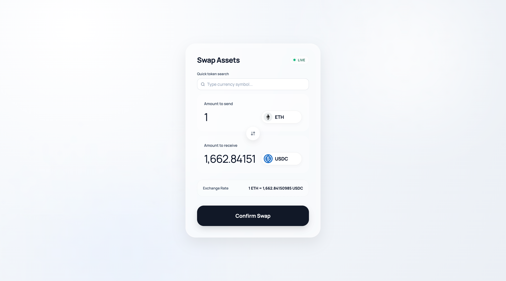

## Screenshot


# Problem 2 - Run Guide

## Prerequisites
- Node.js 18+ and npm

## Run locally
```bash
npm install
npm run dev
```

Open the URL shown in terminal (usually `http://localhost:5173`).

## Production build
```bash
npm run build
npm run preview
```
